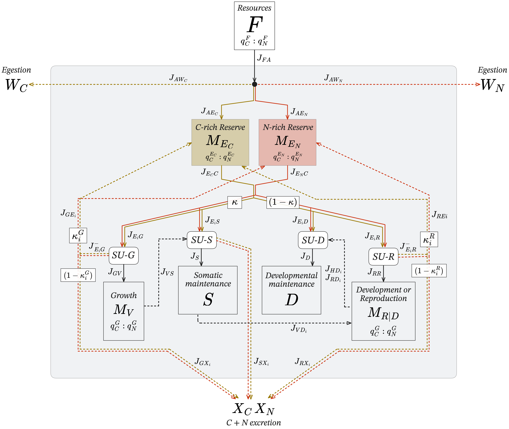

```{r load packages, echo=FALSE, results='hide', message=FALSE, warning=FALSE}
library(tidyverse)
library(kableExtra)
library(knitr)
```

# Assumptions

(Standard DEB assumptions from Table 2.4, DEB Book 3rd Ed, apply)

_Added assumptions:_

* Consumer is heterotrophic and cannot separately uptake inorganic nutrients.
* Consumer is either endothermic, or an ectotherm in a thermally homogenous environment.
* Carbon content is higher than nitrogen in resources within the environment.
* Assimilated products sent to the reserves all contain carbon, but nitrogen is only sent to one reserve, $M_{E_N}$. This can be conceptualized as how amino acids are nitrogen-rich, but also contain significant amounts of carbon.
* The N-rich reserve, $M_{E_N}$, gets priority for carbon assimilation.
* Assimilation efficiency is constant (though this model could be modified such that assimilation efficiency depends on resource quality, etc).
* Movement in landscape increases the organism's somatic maintenance costs.
* Though it is customary in DEB models to excrete biomass used to build maturity maintenance, it is stored within the consumer in this model.
* Stoichiometric molar ratios of carbon to nitrogen are represented as $q_{C}^{Var}:q_{N}^{Var}$, where $q_{C}^{Var}=1$.

_General note:_

* Throughout this example, we use refer to stoichiometric ratios of carbon (C) and nitrogen (N), however, N could correspond to any element *i* (e.g., phosphorus, iron, etc.).

\newpage

# Short Introduction to Synthesizing Units (SUs)

Several metabolic processes are modeled through use of Synthesizing Units (SUs). Simply put, SUs are able to create a product with fixed stoichiometry from streams of different flux substrates that are comprised of different stoichiometries. SUs are analogous both conceptually and mathematically to classical enzyme kinetics (DEBv3), which allows us to model nutrient limitation-type dynamics. When there is a lack of a certain substrate, the product formation (e.g., somatic structure) is delayed. When there is excess of a certain substrate, it is rejected, then partially recycled and the rest excreted. More details about SUs can be found in the DEB book (Kooijman 2000) and also other publications (Sousa et al 2010, Van der Meer 2022). Additionally, our model uses only "parallel" binding, where the order of substrates binding to the SU does not alter the kinetics of SU production.  

There are 2 forms of SU production used in this model, details of which can be found in Chapter 3 of (Kooijman 2000): 

1.  A "demand" SU, which has a constant draw for substrates to meet production needs. These are used for meeting maintenance costs.
2. A "supply" SU, which requires all of the reactants must be in the appropriate amounts to create one unit of product, and will not turnover product until all substrates are bound. A graphical example of this is below.


\newpage

# Theory/Model Derivations

### Diagram of Model and Overview of Important Model Mechanisms



See Table 1 at the end of this document for terms.

\newpage

# Mass Balance Equations 
\begin{align}
\frac{dF}{dt} &= - J_{FA}
\\\nonumber
\\
\frac{d{W_{C}}}{dt} &= J_{W_C}
\\\nonumber
\\
\frac{d{W_{N}}}{dt} &= J_{W_N}
\\\nonumber
\\
\frac{d{M_{E_{C}}}}{dt} &= J_{AE_{C}} + J_{GR{E_C}} - J_{E_{C}C}
\\\nonumber
\\
\frac{d{M_{E_{N}}}}{dt} &= J_{AE_{N}} + J_{GR{E_N}} - J_{E_{N}C}
\\\nonumber
\\
\frac{dM_V}{dt} &= J_{GV} - J_{VS} - J_{VD}
\\\nonumber
\\
\frac{d{M_H}}{dt} &= 
\begin{cases}
J_{RR} & \qquad \text{if } {M_H} < M_{H}^{p} \\
0      & \qquad \text{if } {M_H} \ge M_{H}^{p} 
\end{cases}
\\\nonumber
\\
\frac{d{M_R}}{dt} &= 
\begin{cases}
0 & \qquad \text{if } {M_H} < M_{H}^{p} \\
J_{RR}      & \qquad \text{if } {M_H} \ge M_{H}^{p}  
\end{cases}
\\
\frac{d{X_C}}{dt} &= J_{{E_C}S} + J_{{E_C}D} + J_{{E_N}S} + J_{{E_N}D}+ J_{GRX{E_C}} + J_{GRX{E_N}} + J_{VS} + J_{VD}
\\
\\\nonumber
\frac{d{X_N}}{dt} &= \frac{q_{N}^{E_N}}{q_{C}^{E_N}}\biggr(J_{{E_N}S} + J_{{E_N}D} + J_{GRX{E_N}}\biggr) + \frac{q_{N}^{V}}{q_{C}^{V}}\biggr(J_{VS} + J_{VD}\biggr)
\end{align}

\newpage

# Flux Derivations 

To complete the balance equations with relevant parameters, flux terms must be further specified.

## Ingestion ($J_{FA}$)

The consumer will ingest resources ($F$) in terms of mol-C, with a ratio of C:N of $q_{C}^{F}:q_{N}^{F}$. The ingestion flux is proportional to the surface area of the consumer, such that:

\begin{align*}
J_{FA} &= f\,{\{J_{X{A_M}}\}}\,{V^{2/3}}
\end{align*}

Where $\{J_{X{A_M}}\}$ is the consumer surface area-specific maximum ingestion rate, $V$ is the consumer body volume, and $f$ is the Holling Type II scaled functional response.

The form of the Type II functional response used is:
\begin{align}
\frac{F}{{F_H}+F}
\end{align}

Where ${F_H}$ is the half-saturation constant, which is defined as:

\begin{align*}
F_H &= \frac{\{J_{X{A_M}}\}}{\{F_M\}}
\end{align*}

Where $\{F_M\}$ is the surface-area specific searching rate. 

For this model, it is useful to define the consumer in terms of body mass instead of volume. To define the surface-area specific ingestion rate, we will convert consumer structural volume to biomass, $M_V$ (mol C), for the final form. Due to DEB theory's assumption of strong homeostasis (biochemical composition of state variables must be constant), we can say that the ratio of consumer biomass to volume is constant: $[M_V] = \frac{M_V}{V}$, where $[M_V]$ is the volume-specific structural biomass. Note that this does not mean that *overall stoichiometry* of an organism must remain fixed, as the ratio of reserves to structure (known as *reserve density*, $m_{E_i}$) leads to fluctuations in whole-organism stoichiometries.

For convenience, throughout the model, all internal fluxes will be in units of ($\frac{\text{mol C}}{t}$). The stoichiometries of each state variable will be used to convert between elements and total masses. Thus, for ingestion:

\begin{align}
J_{FA} &= f\,{\{J_{X{A_M}}}\}\,{\biggl(\frac{M_V}{[M_V]}\biggr)^{2/3}}
\end{align}


## Assimilation ($J_{A{E_i}}$)

Upon entering the consumer, $F$ will become assimilated into two reserves: $M_{E_C}$, the carbon-rich reserve, and $M_{E_N}$, the nitrogen-rich reserve. In this model, assimilation efficiencies are constant. Carbon assimilation is prioritized to $M_{E_N}$ before $M_{E_C}$.

The assimilation of resource to the N--rich reserve is:

\begin{align}
J_{A{E_N}} &= \biggl(\frac{q\strut_{N}^{F}}{q\strut_{C}^{F}}\biggr)\biggl(\frac{q\strut_{C}^{E_N}}{q\strut_{N}^{E_N}}\biggr)Y_{{E_N}F}\,J_{FA}
\end{align}

Where $\biggl(\frac{q_{N}^{F}}{q_{C}^{F}}\biggr)$ is the molar proportion of nitrogen in the resource. ${q_{C}^{E_i}}$ couples the amount of carbon to the amount of nitrogen that will be assimilated into reserve$-i$. This coupling ensures that a common flux currency of $\biggl(\frac{mol-C}{time}\biggr)$ is used throughout the internal consumer calculations.

To determine the amount of carbon sent to the carbon-rich reserve, $M_{E_C}$, we will determine how much total carbon could be assimilated from the food, then subtract the amount of carbon sent to $M_{E_N}$ , which takes priority:

\begin{align}
J_{A{E_C}} &= Y_{{E_C}F}\,J_{FA} - J_{A{E_N}}
\end{align}

## Waste/Egestion ($J_{W_i}$)

To calculate the amount of waste ($W_C$ and $W_N$), we will simply determine what was not assimilated from the ingested resource. Egestion fluxes will be in terms of carbon and nitrogen ($\frac{mol\:C}{t}$ and $\frac{mol\:N}{t}$)

\begin{align}
J_{W_C} &= (1-Y_{{E_C}F})\,J_{FA}
\\
J_{W_N} &= \biggl(\frac{q\strut_{N}^{F}}{q\strut_{C}^{F}}\biggr)(1 - Y_{{E_N}F})J_{FA}
\end{align}

\newpage

## Somatic Maintenance ($J_{E_{i}S}$ and $J_{VS}$)

This SU is a "demand" SU, in that the production flux is fixed by the current needs of the organism. Somatic maintenance can be paid from any reserve, and also can be paid from mobilizing structure if the reserves are too low to pay maintenance. Mechanistically, this means the SU will turn over whatever substrate is available. 

The SU has four "binding sites": $M_{E_C}$, $M_{E_N}$, and $M_{V}$. The empty enzyme (i.e., nothing bound) waits for something to bind. It prefers to use $M_{E_C}$ above all other substrates, and prefers to *not* use structure above all other substrates. Thus, the priority for substrate usage by the SU is: $\ce{M_{E_C} -> M_{E_N} -> M_{V}}$

This priority set is created through two mechanisms: $(1)$ the rates of SU turnover for each substrate are lower compared to each substrate with a higher preference ($M_{E_C}$ has the fastest turnover), which allows for $(2)$ unpreferred substrates to be displaced by a preferred substrate, if it is available. This approach to SU kinetics in DEB theory are referred to as a "Preference SU" with substitutable substrates. Short details are available on page 107 of the DEB book v4, Section 3.7.4. Other methods for resolving these kinetics are explained in Van der Meer et al 2022, under the heading "Preference SU with Two Substitutable Substrates".

Note that excretion from this SU is created by the actual mass "used" in meeting somatic maintenance costs. The stoichiometry of excretion is therefore based on the substrate(s) turned over by the SU (i.e., reserve-$i$, etc). 

### Somatic Maintenance SU Flux Overview

Since somatic maintenance is represented by the demand of a constant rate (somatic maintenance rate coefficient, $k_M$) scaled to the current body mass of the organism ($M_V$):

\begin{align*}
J_S &= k_{\scriptscriptstyle M}M_V
\end{align*}

For our model, we have added an additional term to this equation, which incorporates a somatic maintenance penalty for consumer movement. The more consumers move, the more their energetic costs increase:
 
\begin{align} 
J_S &= (k_{\scriptscriptstyle M}M_V)(1 + d\sigma) 
\end{align}

Where $\sigma$ is the multiplicative parameter that controls how severe of a penalty movement imposes, and $d$ is the distance walked by the consumer.

$J_S$ is easy to calculate. What is more complex to calculate is how much of each reserve or structure is used in the process of meeting maintenance costs, $J_{{E_i}S}$ if using reserve-$i$, and/or $J_{VS}$ if mobilizing structure. We start by identifying that the total demanded maintenance is paid from some combination of our four substrates:

\begin{align}
J_S &= {k_M}{M_V} = J_{{E_C}S} + J_{{E_N}S} + J_{VS}
\\
J_S &= {k_M}{M_V} = {Y_{S{E_C}}}\,{k\strut^S_C}\,\frac{\theta\strut^{S*}_C}{\theta\strut^{S*}_{tot}} + {Y_{S{E_N}}}\,{k\strut^S_N}\,\frac{\theta\strut^{S*}_N}{\theta\strut^{S*}_{tot}} +  {Y_{S{V}}}\,{k\strut^S_V}\,\frac{\theta\strut^{S*}_V}{\theta\strut^{S*}_{tot}}
\end{align}

Where $\theta\strut^{S*}_i$ is the proportion of SU in a particular binding state (none, C, or N reserve) at equilibrium, and $\theta^{S*}_{tot}$ is the sum of all binding states at equilibrium ($\theta\strut^{S*}_o + \theta\strut^{S*}_C + \theta\strut^{S*}_N+ \theta\strut^{S*}_V$). Equilibrium values of these binding states depend on equations for the kinetics of this SU.

\newpage

### Somatic Maintenance SU Kinetics 

Here we assume a “Preference SU with four substitutable substrates” following a derivation of a similar SU by Van Der Meer (2022). This representation is equivalent to that of Kooijman (DEB3). Once bound to a substrate, we assume the SU turns over (i.e., produces maintenance) at substrate-specific rates, ${k\strut^S_i}$. The SU imposes preferential use of substrates with higher ${k\strut^S_i}$. Additionally, we assume that more preferred substrates can displace less preferred substrates already bound to the SU without inhibition.

The kinetics of the SU are described below. $\theta_{\text{o}}^S$ corresponds to the proportion of SUs that have nothing bound (empty). ${\theta\strut^{S}_{i}}$ and ${\theta\strut^{S}_{{V}}}$ correspond to an SU bound with reserve-$i$ or structure, respectively. The arrival rates for reserve substrates are described by ${\kappa_i}\,{J_{{E_i}C}}$, and the arrival flux of structure is described by $J_{{VC}}$. The rates of SU turnover for each substrate are described by ${k\strut^S_i}$ for reserve substrates and ${k\strut^S_V}$ for structure. *In the equations below, please note the distinction between $\kappa$, the proportion of mobilized reserves allocated to somatic versus reproduction processes, and $k$'s, SU turnover rates.

The differential equations for the SU binding states are:

\begin{align}
\frac{d{\theta\strut^{S}_{o}}}{dt} &= {k\strut^S_C}{\theta\strut^{S}_{{C}}} + {k\strut^S_N}{\theta\strut^{S}_{{N}}} + {k\strut^S_V}{\theta\strut^{S}_{{V}}} - {\theta\strut^{S}_{o}}\biggl({\kappa_C}{J_{{E_C}C}} + {\kappa_N}{J_{{E_N}C}} + J_{{VC}}\biggr)
\\
\frac{d{\theta\strut^{S}_C}}{dt} &= {\kappa_C}\,{J_{{E_C}C}}\biggl({\theta\strut^{S}_{o}} + {\theta\strut^{S}_{N}}  + {\theta\strut^{S}_{V}}\biggr) - {k\strut^S_C}{\theta\strut^{S}_{{C}}}
\\
\frac{d{\theta\strut^{S}_N}}{dt} &= {\kappa_N}\,{J_{{E_N}C}}\biggl({\theta\strut^{S}_{o}} + {\theta\strut^{S}_{V}}\biggr) - {\theta\strut^{S}_{{N}}}\biggl({k\strut^S_N} + {\kappa_C}\,{J_{{E_C}C}}\biggr)
\\
\frac{d{\theta\strut^{S}_V}}{dt} &= J_{{VC}}{\theta\strut^{S}_{o}} - {\theta\strut^{S}_{{V}}}\biggl({k\strut^S_V} +  {\kappa_C}\,{J_{{E_C}C}} + {\kappa_N}\,{J_{{E_N}C}}\biggr)
\\
1 &= {\theta\strut^{S}_{\text{tot}}} = {\theta\strut^{S}_{o}} + {\theta\strut^{S}_{{C}}} + {\theta\strut^{S}_{N}} + {\theta\strut^{S}_{V}}
\end{align}

The steady state equations of binding states that turnover the SU are as follows, per Mathematica (Some terms are presented as $A$, etc, to ensure equations fit on one line):

\begin{align}
\frac{\theta^{S*}_C}{\theta^{S*}_{tot}} &= \frac{{\kappa_C}\,{J_{{E_C}C}}}{\biggl({\kappa_C}\,{J_{{E_C}C}} + {k\strut^S_C}\biggr)}
\\
\frac{\theta^{S*}_N}{\theta^{S*}_{tot}}&= \frac{{\kappa_N}\,{J_{{E_N}C}}\,{k\strut^S_C}}{\biggl({\kappa_C}\,{J_{{E_C}C}} + {k\strut^S_C}\biggr)\biggl({\kappa_C}\,{J_{{E_C}C}} + {\kappa_N}\,{J_{{E_N}C}} + {k\strut^S_N}\biggr)}
\\
\frac{\theta^{S*}_V}{\theta^{S*}_{tot}}&= \frac{J_{{VCS}}{k\strut^S_C}\biggl({\kappa_C}\,{J_{{E_C}C}} + {k\strut^S_N}\biggr)}{\biggl({\kappa_C}\,{J_{{E_C}C}} + {k\strut^S_C}\biggr)\biggl({\kappa_C}\,{J_{{E_C}C}} + {\kappa_N}\,{J_{{E_N}C}} + {k\strut^S_N}\biggr)\biggl({\kappa_C}\,{J_{{E_C}C}} + {\kappa_N}\,{J_{{E_N}C}} + J_{VC} + {k\strut^S_V}\biggr)}
\end{align}

Note that the steady state for turning over the SU with $M_{E_C}$ is independent of other substrate dynamics (and mimics Michaelis-Menten kinetics or the Holling Type II functional response). This makes sense, given that our mechanistic goal was that if $M_{E_C}$ is present in enough capacity, it will turn the SU over, regardless of the presence of $M_{E_N}$.

As previously discussed, we can then write the turnover rate of our unpreferred substrates as fraction of our preferred substrate, with $\rho\strut^S_i$ as the fractional preference parameter (e.g., $\rho\strut^S_N = \frac{k^S_N}{k^S_C}$). We then have:

\begin{align}
{k\strut^S_C} &= k_S
\\
{k\strut^S_N} &= {\rho\strut^S_N}{k_S}
\\
{k\strut^S_V} &= {\rho\strut^S_V}{k_S}
\\
1 &> {\rho\strut^S_N} > {\rho\strut^S_V}
\end{align}

If we implement the above simplification, then the steady state equations become:

\begin{align}
\frac{\theta^{S*}_C}{\theta^{S*}_{tot}} &= \frac{{\kappa_C}\,{J_{{E_C}C}}}{\biggl({\kappa_C}\,{J_{{E_C}C}} + {k_S}\biggr)}
\\
\frac{\theta^{S*}_N}{\theta^{S*}_{tot}}&= \frac{{\kappa_N}\,{J_{{E_N}C}}\,{k_S}}{\biggl({\kappa_C}\,{J_{{E_C}C}} + {k_S}\biggr)\biggl({\kappa_C}\,{J_{{E_C}C}} + {\kappa_N}\,{J_{{E_N}C}} + {\rho\strut^S_N}{k_S}\biggr)}
\\
\frac{\theta^{S*}_V}{\theta^{S*}_{tot}}&= \frac{{J_{VCS}}{k_S}\biggl({\kappa_C}\,{J_{{E_C}C}} + {\rho\strut^S_N}{k_S}\biggr)}{\biggl({\kappa_C}\,{J_{{E_C}C}} + {k_S}\biggr)\biggl({\kappa_C}\,{J_{{E_C}C}} + {\kappa_N}\,{J_{{E_N}C}} + {\rho\strut^S_N}{k_S}\biggr)\biggl({\kappa_C}\,{J_{{E_C}C}} + {\kappa_N}\,{J_{{E_N}C}} + {J_{VCS}} + {\rho\strut^S_V}{k_S}\biggr)}
\end{align}

Additionally, the equation to meet somatic maintenance, using the preference simplification is:

\begin{align}
J_S &= {k_M}{M_V} = k_S\,\frac{\theta\strut^{S*}_C}{\theta\strut^{S*}_{tot}} \,+\, k_S\,\rho\strut^S_N\,\frac{\theta\strut^{S*}_N}{\theta\strut^{S*}_{tot}} \,+\, \,k_S\,\rho\strut^S_V\,\frac{\theta\strut^{S*}_V}{\theta\strut^{S*}_{tot}}
\end{align}

If we additionally assume (following similarly to Van der Meer 2022) (1) that we mobilize just as much C-mol of structure as may be needed to pay maintenance costs if it is needed to be paid by structure in full ($J_{VC} = J_S$)

Then it follows that:
\begin{align}
J_{{E_C}S} &= \,k_S\,\frac{\theta^{S*}_C}{\theta^{S*}_{tot}} 
\\
J_{{E_N}S} &= \,k_S\,\rho\strut^S_N\,\frac{\theta^{S*}_N}{\theta^{S*}_{tot}}
\\
J_{VS} &= \,k_S\,\rho\strut^S_V\,\frac{\theta^{S*}_V}{\theta^{S*}_{tot}}
\end{align}

To solve for these four fluxes, after substituting the  $\frac{\theta^{S*}_i}{\theta^{S*}_{tot}}$ terms, we still must define $k_S$. Per Eqn. $(11)$, we can see that $k_S$ is not a free parameter, but has a solution that can be numerically solved (Note that if only two substrates are used for this type of SU, there is an explicit solution for $k_S$ using the positive root of the quadratic formula).

Note that any mobilized structure that is not used for maintenance is shuttled directly back to structure, so that the only dissipation of structure is $J_{VS}$.

### Somatic Maintenance Excretion

The dissipation of mass used in meeting maintenance costs is equal to the cost themselves (the energy is used for the organism but the mass itself is excreted).

\newpage

## Developmental Maintenance ($J_{E_{i}D}$) 

Developmental maintenance is paid through an SU ($SU-D$) that is nearly identical to the somatic maintenance SU. Developmental maintenance must be paid according to:

\begin{align}
J_D &= k_{\scriptscriptstyle J}M_H
\end{align}

Where $k_{\scriptscriptstyle J}$ is the maturity maintenance rate coefficient, and $M_H$ is the current level of maturity of the consumer. 

*Important note about insufficient reserves and rejuvenation*:
Unlike the somatic maintenance SU, if reserves are too low to pay developmental maintenance, then  the consumer can "rejuvenate", and loses its maturity level. This comes from pg 134 of Bas Kooijman's comments on DEBv3, seen here: https://www.bio.vu.nl/thb/deb/deblab/bib/Kooy2010_c.pdf However, in this model, we decided to implement that structure can also be broken down to meet reproductive needs. This was decided both due to efficiency in numerical solving methods in the simulation, and because we wanted to maintain the hare precocial trait in our case study. 

Since a preference SU has already been instituted, the developmental SU therefore has substrates $M_{E_C}$, $M_{E_N}$, and $M_{V}$  from highest to lowest preference.

Following the previous steps outlined for somatic maintenance, we can arrive at the following final fluxes:
\begin{align}
\frac{\theta^{D*}_C}{\theta^{D*}_{tot}} &= \frac{(1 - {\kappa_C}){J_{{E_C}C}}}{\biggl((1 - {\kappa_C}){J_{{E_C}C}} + {k_D}\biggr)}
\\
\frac{\theta^{D*}_N}{\theta^{D*}_{tot}}&= \frac{(1 - {\kappa_N}){J_{{E_N}C}}\,{k_D}}{\biggl((1 - {\kappa_C}){J_{{E_C}C}} + {k_D}\biggr)\biggl({(1 - {\kappa_C}){J_{{E_C}C}} + (1 - {\kappa_N}){J_{{E_N}C}} + {\rho\strut^D_N}{k_D}\biggr)}}
\\
\frac{\theta^{D*}_V}{\theta^{D*}_{tot}}&= \frac{{J_{VCD}}{k_D}\biggl((1 - {\kappa_C}){J_{{E_C}C}} + {\rho\strut^D_N}{k_D}\biggr)}{A * B * C}
\\\nonumber
A &= \biggl((1 - {\kappa_C}){J_{{E_C}C}} + {k_D}\biggr)
\\\nonumber
B &= \biggl((1 - {\kappa_C}){J_{{E_C}C}} + (1 - {\kappa_N}){J_{{E_N}C}} + {\rho\strut^D_N}{k_D}\biggr)
\\\nonumber
C &= \biggl((1 - {\kappa_C}){J_{{E_C}C}} + (1 - {\kappa_N}){J_{{E_N}C}} + {J_{VCD}} + {\rho\strut^D_V}{k_D}\biggr)
\\
J_{{E_C}D} &= \,k_D\,\frac{\theta^{D*}_C}{\theta^{D*}_{tot}} 
\\
J_{{E_N}D} &= \,k_D\,\rho\strut^D_N\,\frac{\theta^{D*}_N}{\theta^{D*}_{tot}}
\\
J_{VD} &= \,k_D\,\rho\strut^D_V\,\frac{\theta^{D*}_V}{\theta^{D*}_{tot}}
\end{align}

Note that numerical solving is also needed for these fluxes.

Similar to somatic growth, all mass used in meeting development maintenance costs is excreted into the environment.

\newpage

## Somatic Growth ($J_{GV}$ and $J_{E_{i}G}$)

Somatic growth occurs when 1) somatic maintenance costs are met and 2) enough of \emph{n}-nutrients are in reserves to create a unit of structural mass. Structure is assumed to have fixed stoichiometry. $J_{GV}$ is the flux of structural growth, produced by the growth SU, $SU$-$G$. 

$J_{E_{i}G}$ is the flux from reserve-\emph{i} to the growth SU, $SU$-$G$, as specified by:
\begin{align}
J_{E_{i}G} &= {\kappa_{i}} J_{E_{i}C}-J_{E_{i}S}
\end{align}

Where ${\kappa_{i}}$ is the portion of flux mobilized from reserve-\emph{i} ($J_{E_{i}C}$) that goes towards somatic growth and maintenance, following Kooijman's $\kappa$-rule, $J_{E_{i}S}$ is the flux from reserve-\emph{i} to somatic maintenance.

### Growth SU Kinetics

We represent this as a parallel, complementary SU (substrate $A$ binding is not dependent on substrate $B$ being bound first), more details can be found on pg. 105 of DEBv3. Material from all three reserves can bind in any order, but a unit of structure is not formed until enough of reserves $-C$ and $-N$ are bound to the SU. Reserve fluxes in excess are rejected by the SU $J_{E_{i}G}^{-}$, with some portion $\kappa_{i}^{G}$ recycled back into the reserves and $\biggl(1-\kappa_{i}^{G}\biggr)$ is excreted into the environment

The kinetics of the growth SU ($SU-G$) are given below. $\theta_{\text{o}}^G$ corresponds to the density of SUs that have nothing bound (empty). $\theta_{CN}^G$ corresponds to the SU bound with all three reserves. There is no difference in binding probability in substrate binding order ($M_{E_C}$ will bind with the same affinity if the SU empty or has $M_{E_N}$ bound already).

The full ODE set of SU kinetics are given as:

\begin{align}
\frac{d\theta\strut_{\text{o}}^G}{dt} &= k_{\scriptscriptstyle G}\theta\strut_{\text{CN}}^{G} - \theta\strut_{\text{o}}^G\biggl(\frac{J_{E_{C}G}}{Y_{{E_C}V}} + \frac{J_{E_{N}G}}{Y_{{E_N}V}}\biggr)
\\
\frac{d\theta\strut_{\text{C}}^G}{dt} &= {\theta\strut_{\text{o}}^G}\frac{J_{E_{C}G}}{Y_{{E_C}V}} - {\theta\strut_{\text{C}}^G}\frac{J_{E_{N}G}}{Y_{{E_N}V}}
\\
\frac{d\theta\strut_{\text{N}}^G}{dt} &= {\theta\strut_{\text{o}}^G}\frac{J_{E_{N}G}}{Y_{{E_N}V}} - {\theta\strut_{\text{C}}^G}\frac{J_{E_{C}G}}{Y_{{E_C}V}}
\\
\frac{d\theta\strut_{\text{CN}}^G}{dt} &= {\theta\strut_{\text{N}}^G}\frac{J_{E_{C}G}}{Y_{{E_C}V}} + {\theta_{\text{C}}^G}\frac{J_{E_{N}G}}{Y_{{E_N}V}} - k_{\scriptscriptstyle G}\theta\strut_{\text{CN}}^{G}
\end{align}

Where $Y_{{E_i}V}$ is the yield of reserve on structure (i.e., how many units of reserve $M_{E_i}$ are needed to make one unit of structure)

### Growth SU Fluxes

The reaction occurs when units of $M_{E_C}$, and $M_{E_N}$ are bound to the SU (SU state $\theta\strut_{\text{CN}}^G$) and the SU disassociates at rate $k_{\scriptscriptstyle G}$. Therefore, the flux of somatic growth is:

\begin{align}
J_{GV} &= k_{\scriptscriptstyle G}\theta\strut_{\text{CN}}^{G\text{*}} 
\end{align}

Where $\theta_{\text{CN}}^{G\text{*}}$ is the steady state of the fully bound SU. Using Mathematica or Kooijman 1998 (_Biophys Chem_) Equation 10, to solve for $\theta\strut_{\text{CNP}}^{G\text{*}}$, the fully specified somatic growth flux is:

\begin{align}
  J_{GV} &= \biggl(\biggl(\frac{J_{E_{C}G}}{Y_{{E_C}V}}\biggr)^{-1} + \biggl(\frac{J_{E_{N}G}}{Y_{{E_N}V}}\biggr)^{-1} - \biggl(\frac{J_{E_{C}G}}{Y_{{E_C}V}} + \frac{J_{E_{N}G}}{Y_{{E_N}V}}\biggr)^{-1}\biggr)^{-1}
\end{align}

### Stoichiometry of Somatic Structure

The yield parameters, $Y_{{E_i}V}$, are defined by the stoichiometries measured by the user. 

It may be more intuitive to think of these yield parameters as the number of substrates that must bind to the SU to form the reaction. To make one unit (mole) of structure from reserves, we must conceptualize how many C-mol and N-mol are being bound and combined at the SU. The mols of each reserve that binds to the growth SU ($n_{E_i}^{V}$) to produce some amount of structure ($n_V$) follow:

\begin{align}
{q\strut_{C}^{V}}{n_V} &= {q\strut_{C}^{E_C}}{n_{E_C}^{V}} + {q\strut_{C}^{E_N}}{n_{E_N}^{V}}
\\
{q\strut_{N}^{V}}{n_V} &= {q\strut_{N}^{E_C}}{n_{E_C}^{V}} + {q\strut_{N}^{E_N}}{n_{E_N}^{V}}
\end{align}

To convert between mol C of the state variables, the yields must follow :

\begin{align}
Y_{{E_C}V} &= \frac{{n_{E_C}^{V}}{q\strut_{C}^{E_C}}}{{n_V}{q\strut_{C}^{V}}}
\\
Y_{{E_N}V} &= \frac{{n_{E_N}^{V}}{q\strut_{C}^{E_N}}}{{n_V}{q\strut_{C}^{V}}}
\end{align}

and $n_V = 1$

### Other Important Fluxes from Growth SU

To track reserve recycling and environmental dissipation (i.e., excretion) from rejected SU fluxes, the following relationships are needed:

The input to the SU, $J_{E_{i}G}$, is split into two fluxes: that which is accepted (bound) to the SU, $J_{E_{i}G}^{+}$, and that which is rejected (excess), $J_{E_{i}G}^{-}$, . The obvious quantity then:

\begin{equation}
J_{E_{i}G} = J_{E_{i}G}^{+} + J_{E_{i}G}^{-}
\end{equation}

\begin{align}
J_{E_{i}G}^{+} &= {J_{GV}}{Y_{{E_i}V}}
\\
J_{E_{i}G}^{-} &= J_{{E_i}G} - J_{E_{i}G}^{+}
\\
J_{G{X{_C}}} &= \biggl(1-\kappa_{C}^{G}\biggr)J_{E_{C}G}^{-} + \biggl(1-\kappa_{N}^{G}\biggr)J_{E_{N}G}^{-}
\\
J_{G{X{_N}}} &= \frac{q^{E_N}_N}{q^{E_N}_C}\biggl(1-\kappa_{N}^{G}\biggr)J_{E_{N}G}^{-}
\end{align}

\newpage

## Reproduction and Development ($J_{RR}$ and $J_{E_{i}R}$)

Reproduction and development (i.e., maturity) come from the reproduction SU, $SU-R$, in a similar design as structural growth from $SU-G$. However, an organism will develop (i.e., mature) until a certain threshold when it is then able to begin reproducing, $D_R$, as seen in Eqs $(7)$ and $(8)$.

$J_{E_{i}R}$ is the flux from reserve-\emph{i} to the reproduction SU, $SU-R$, as specified by: 
\begin{equation}
J_{E_{i}R}=(1-{\kappa\strut_{i}}) J_{E_{i}C}-J_{E_{i}D}
\end{equation}

Following the same derivation as in the structural growth SU, we arrive at the following equation:

\begin{align}
  J_{RR} &= \biggl(\biggl(\frac{J_{E_{C}R}}{Y_{{E_C}R}}\biggr)^{-1} + \biggl(\frac{J_{E_{N}R}}{Y_{{E_N}R}}\biggr)^{-1} - \biggl(\frac{J_{E_{C}R}}{Y_{{E_C}R}} + \frac{J_{E_{N}R}}{Y_{{E_N}R}}\biggr)^{-1}
\end{align}


Additional fluxes of interest are derived via the same method as outlined in the somatic growth SU section:

\begin{align}
J_{E_{i}R}^{+} &= {J_{RR}}{Y_{{E_i}R}}
\\
J_{E_{i}R}^{-} &= J_{{E_i}R} - J_{E_{i}R}^{+}
\\
J_{R{X{_C}}} &= \biggl(1-\kappa_{C}^{R}\biggr)J_{E_{C}R}^{-} + \biggl(1-\kappa_{N}^{R}\biggr)J_{E_{N}R}^{-}
\\
J_{R{X{_N}}} &= \frac{q^{E_N}_N}{q^{E_N}_C}\biggl(1-\kappa_{N}^{R}\biggr)J_{E_{N}R}^{-}
\end{align}

The organism will use $J_{RR}$ to mature/develop reproductively ($M_H$), until they reach a threshold, $M_{H}^{p}$, at which point they are no longer a juvenile and can reproduce. Following this threshold, they maintain $M_H = M_{H}^{p}$, and instead build their reproductive buffer, $M_R$ with $J_{RR}$. Once their reproductive buffer is full enough to produce offspring, $M_{R}^{b}$, they will reproduce, and their reproductive buffer will reset to 0.

\newpage

## Excretion Dynamics 

To account for total excretion from the organism, we will simply gather all fluxes of excretion from each of the SUs. We have ensured that we have converted reserves to mol-element when needed (i.e., detailing the mol-N from excreted rejected reserve from the growth SU). Note that the $\kappa_{i}^{Var}$ parameters below are the fraction of rejected SU flux that are recycled back to the reserves, and $(1- \kappa_{i}^{Var})$ are excreted into the environment. This ensures that the reserves do not fill above their maximum (Kooijman 2000).

The combined fluxes of rejected reserves from $SU-G$ and $SU-R$ that are recycled back to their reserves are: 
\begin{align}
J_{GR{E_C}} &= \kappa_{C}^{G}J_{E_{C}G}^{-} + \kappa_{C}^{R}J_{E_{C}R}^{-}
\\
J_{GR{E_N}} &= \kappa_{N}^{G}J_{E_{N}G}^{-} + {\kappa_{N}^{R}}J_{E_{N}R}^{-} 
\end{align}

And the combined fluxes of rejected reserves from $SU-G$ and $SU-R$ that are excreted into the environment are:
\begin{align}
J_{GR{X_{E_C}}} &= \biggl(1-\kappa_{C}^{G}\biggr)J_{E_{C}G}^{-} + \biggl(1-\kappa_{C}^{R}\biggr)J_{E_{C}R}^{-}
\\
J_{GR{X_{E_N}}} &= \biggl(1-\kappa_{N}^{G}\biggr)J_{E_{N}G}^{-} + \biggl(1-\kappa_{N}^{R}\biggr)J_{E_{N}R}^{-}
\end{align}

\newpage

## Reserve Dynamics ($J_{E_{i}C}$)

We have one last flux to derive, the reserve mobilization flux, $J_{E_{i}C}$. The reserve dynamics are the heart of DEB theory, buffering organisms from short-term nutrient limitation. For reference, it is recommended to visit the strong and weak homeostasis DEB assumptions for building intuition about how this will be derived. 

While we can deduce that the reserve mobilization flux must be:

\begin{align*}
J_{{E_i}C} &= J_{{E_i}S} + J_{{E_i}D} + J_{{E_i}G} + J_{{E_i}R}
\end{align*}

However, this form isn't informative, as those fluxes are defined by $J_{{E_i}C}$.

We can get another form of $J_{{E_i}C}$ from discussing a quantity that is often helpful: reserve density, $\varepsilon=\frac{E}{V}$ or $m_E = \frac{M_E}{M_V}$, depending on the formulation most convenient. Here, we will use $m_E$.

Reserve density acts as a physiological indicator of nutritional status: when it is high, it indicates that the consumer has a high level of reserve storage. As it approaches 0, the organism is starving, as very little of its total bodymass is any nutrient storage. 

To begin, we can simply make a mass-balance equation of reserve density. There are numerous ways to do this, but we will take the following approach:

If $m_{E_i} = \frac{M_{E_i}}{M_V}$, and we have already built $\frac{d{M_{E_i}}}{dt}$ and $\frac{d{M_V}}{dt}$ from mass-balance, then to determine $\frac{d{m_{E_i}}}{dt}$, we can use the calculus quotient rule to derive:

\begin{align*}
\frac{d{m_{E_i}}}{dt} &= \frac{1}{M_V}\biggr(\frac{d{M_{E_i}}}{dt} - \frac{M_{E_i}}{M_V}\frac{dM_V}{dt}\biggr)
\\
&= \frac{1}{M_V}\biggl(\frac{dM_{E_i}}{dt}\biggr) - m_{E_i}\dot{r}
\\
\end{align*}

Where $\dot{r}$ is the specific growth rate parameter, defined in DEB theory as $\dot{r}=\frac{1}{M_V}\frac{dM_V}{dt}$. Additionally, the term $-m_{E_i}\dot{r}$ accounts for "reserve dilution by growth" (as consumer grows with same amount of reserve, the reserve density will decrease)

This brings us to one of two important forms of the dynamics of reserve density:

\begin{align}
\frac{d{m_{E_i}}}{dt} &= \frac{1}{M_V}\biggl(J_{AE_{i}} + J_{GR{E_i}} - J_{E_{i}C}\biggr) - m_{E_i}\dot{r}
\end{align}

Another form is drawn from the weak homeostasis assumption, and can be read in more depth in Ch2 of DEB book v3. The equation, modified from DEBv3 $(\text{Eq. }3.8)$ is:

\begin{align}
\frac{dm_{E_i}}{dt} &= \frac{\{J_{{A{E_i}}_M}\}}{M_V}\biggl(f - \frac{m_{E_i}}{m_{{E_i}_M}}\biggr) + \frac{J_{GR{E_i}}}{M_V}
\end{align}

Where $\{J_{{A{E_i}}_M}\}$ is the surface-area specific maximum assimilation flux to reserve$-i$. This can be calculated from $\frac{J_{A{E_i}}}{V^2}$, where $f=1$: $\{J_{{A{E_N}}_M}\}=\{J_{X{A_M}}\}Y_{F{E_N}}q\strut_{C}^{E_N}\biggl(\frac{q\strut_{N}^{F}}{q\strut_{C}^{F} + q\strut_{N}^{F}}\biggr)$ and $\{J_{{A{E_C}}_M}\}=\{J_{X{A_M}}\}Y_{F{E_C}}\biggl(\frac{q\strut_{C}^{F}}{q\strut_{C}^{F} + q\strut_{N}^{F}}\biggr)-\{J_{{A{E_N}}_M}\}$

If we isolate $J_{{E_i}C}$ from $\frac{dm_{E_i}}{dt}=\frac{dm_{E_i}}{dt}$, then you can arrive at:

\begin{align}
J_{{E_i}C} &= m_{E_i}\biggl(\frac{\{J_{{A{E_i}}_M}\}}{m_{{E_i}_M}} - {M_V}\dot{r}\biggr)
\end{align}

Where $m_{{E_i}_M}$ is the maximum reserve$-i$ density. 

A version with compound parameters (avoids mis-estimating dependent parameters) is found through conversions using page 93 and the Appendix of DEBv3 book, and seen in Sousa et al 2010, $Eq.\;3$: 

\begin{align}
J_{{E_i}C} &= {M_{E_i}}\biggl(\dot{\nu}\biggl(\frac{M_V}{[M_V]}\biggr)^{-1/3} - \dot{r}\biggr)
\end{align}

where, $\dot{\nu} = \dot{p_{Am}}/[E_{m}]$ and $\dot{p_{Am}}$ is the surface-area-specific maximum assimilation rate and $[E_m]$ is the maximum energy density.

\newpage


# Table 1: Definitions of Terms

\renewcommand{\arraystretch}{1.15}
```{r data for table, echo=FALSE}

# Create a data frame with parameter terms
parameter_data <- data.frame(
  Term = c("$F$",
           "$M_{E_i}$",
           "$E_i$",
           "$m_{E_i}$",
           "$M_V$",
           "$L$",
           "$V$",
           "$M_H$",
           "$M_R$",
           "$X\\strut^{SU}_{i}$",
           "$\\{J_{X{A_M}}\\}$",
           "$F_H$",
           "$\\{F_M\\}$",
           "$[M_V]$",
           "$\\large{\\dot{r}}$",
           "$M_{H}^{b}$",
           "$M_{H}^{p}$",
           "$M_{R}^{r}$",
           "$k_{\\scriptscriptstyle M\\text{ or }J}$",
           "$k_{\\scriptscriptstyle SU-x}$",
           "$Y_{1*2}$",
           "$\\large{q\\strut^{Var}_{i}}$",
           "$\\large{\\kappa}$",
           "$\\large{\\kappa_{i}^{GR}}$",
           "$\\sigma$",
           "$d$",
           "$\\rho\\strut_{SU}$",
           "$J_{{\\scriptscriptstyle 1}*{\\scriptscriptstyle 2}}$",
           "$J\\strut^{-\\text{ or }+}_{{\\scriptscriptstyle 1}*{\\scriptscriptstyle 2}}$",
           "${\\theta\\strut^{SU}_{o}}$",
           "${\\theta\\strut^{SU}_{{i}}}$"),
  Description = c("Resource",
                  "Reserve$-i$ biomass",
                  "Reserve$-i$ energy",
                  "Reserve$-i$ density $\\biggl(\\frac{M_{E_i}}{M_V}\\biggr)$",
                  "Somatic structural biomass",
                  "Somatic structural length",
                  "Somatic structural volume ($L^3$)",
                  "Biomass of reserves invested in maturation/development",
                  "Biomass of reserves invested in reproduction buffer, following maturation",
                  "Excreted/non-recycled material of element$-i$ from $SU-x$",
                  "Surface-area specific maximum ingestion rate",
                  "Type II functional response half-saturation constant",
                  "Type II functional response surface-area search rate",
                  "Volume-specific structural mass $\\frac{M_V}{V}$ (constant due to strong homeostasis assumption)",
                  "Specific growth rate $(\\frac{1}{M_V}\\frac{d{M_V}}{dt})$",
                  "Maturity level at birth",
                  "Maturity threshold for puberty",
                  "Reproductive buffer threshold for reproduction",
                  "Maintenance rate coefficient (M for somatic, J for maturity)",
                  "SU disassociation coefficient",
                  "Yield of transformation/conversion of $Var1$ into $Var2$",
                  "Quota (ratio) of nutrient$-i$ in state variable, with values normalized so that lowest quota is 1",
                  "Proportion of mobilized reserves allocated to somatic vs reproductive processes",
                  "Proportion of SU-rejected reserves recycled back to reserves vs excreted",
                  "Increase of somatic maintenance costs due to consumer movement",
                  "Distance walked by consumer",
                  "Preference for using a specific substrate in maintenance SUs, compared to C-reserve",
                  "Flux (absolute) from SU/state variable$-$1 to SU/state variable$-$2",
                  "Flux (absolute) that is rejected by the SU or accepted, respectively",
                  "Fraction of $SU-x$ binding sites that are empty/available to bind substrate",
                  "Fraction of $SU-x$ binding sites that are bound with substrate"),
  Units = c("mol C",
            "mol C", 
            "$J$",
            "$(\\text{mol C})(\\text{mol C})^{-1}$",
            "mol C",
            "cm",
            "cm$^3$",
            "mol C",
            "mol C",
            "mol C",
            "$(\\text{mol Food})({{V^{2/3}}*t})^{-1}$",
            "mol Food",
            "$({\\text{cm}^2})(t^{-1})$",
            "$(\\text{mol C}){\\text{cm}^{-3}}$",
            "$t^{-1}$",
            "$\\text{mol C}$",
            "$\\text{mol C}$",
            "$\\text{mol C}$",
            "$t^{-1}$",
            "$(\\text{mol C})t^{-1}$",
            "$-$",
            "mol $i$",
            "$-$",
            "$-$", 
            "Distance$^-1$, variable units",
            "Variable units",
            "$-$", 
            "$(\\text{mol C})t^{-1}$",
            "$(\\text{mol C})t^{-1}$",
            "$-$",
            "$-$")
)

Subtitles = as.character(c("State Variables","Parameters","Flux-related Terms","Synthesizing Unit (SU)-Related Terms"))

# Print the table with full width using kableExtra
parameter_data %>%
  kable(format = "latex", escape = FALSE, booktabs = TRUE, align="clc") %>%
  column_spec(1,width= "1.5cm", latex_valign="m") %>%
  column_spec(2,width= "12cm", latex_valign="m") %>%
  column_spec(3,width= "2.5cm", latex_valign="m") %>%
  row_spec(0, align = "c", font_size=11) %>%
  pack_rows(Subtitles[1],start_row=1,end_row=10, escape=F, indent=T) %>%
  pack_rows(Subtitles[2],start_row=11,end_row=27, escape=F, indent=T) %>%
  pack_rows(Subtitles[3],start_row=28,end_row=30, escape=F, indent=T) %>%
  pack_rows(Subtitles[4],start_row=30,end_row=31, escape=F, indent=T) %>%
  kable_styling(latex_options =c("hold_position","striped"))
```

\vspace{.01cm}
